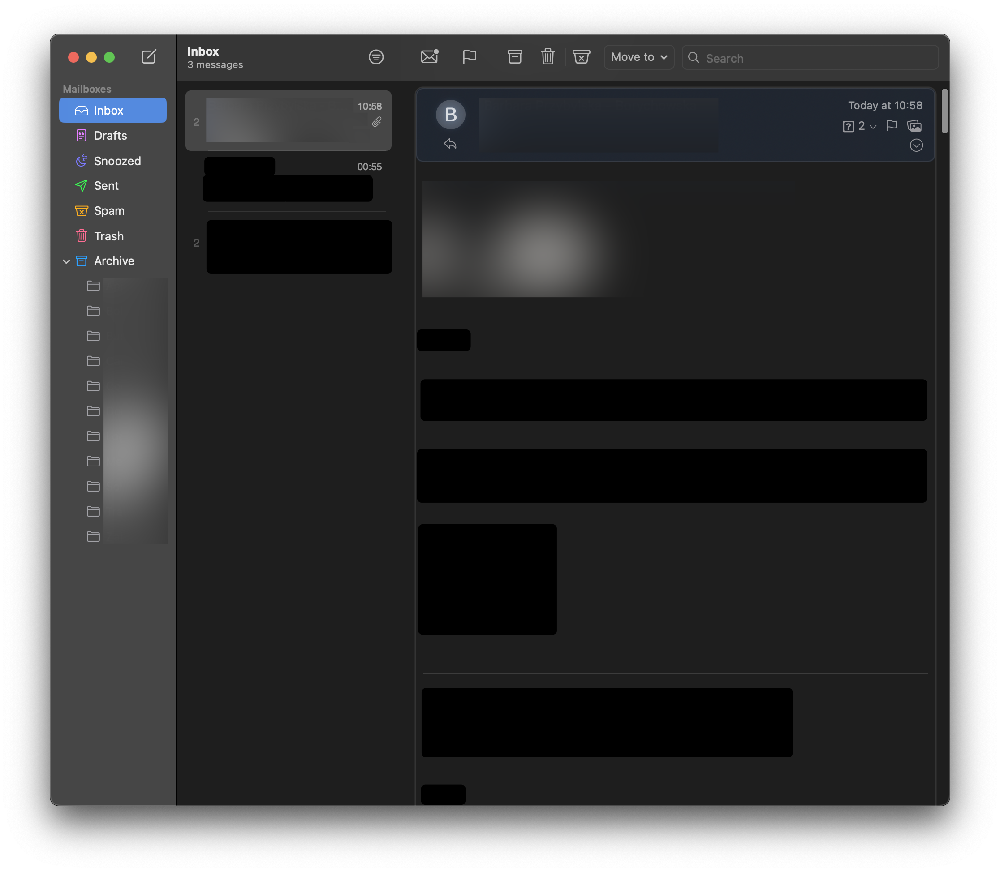

# [Swift Mail](https://swiftmail.io) ★★★

- decent, minimal UI
- integrates very nicely with FastMail (folders, snoozed, etc.)
- no contacts integration (for now)
- some animation glitches
- no menubar icon, no running in background

 

