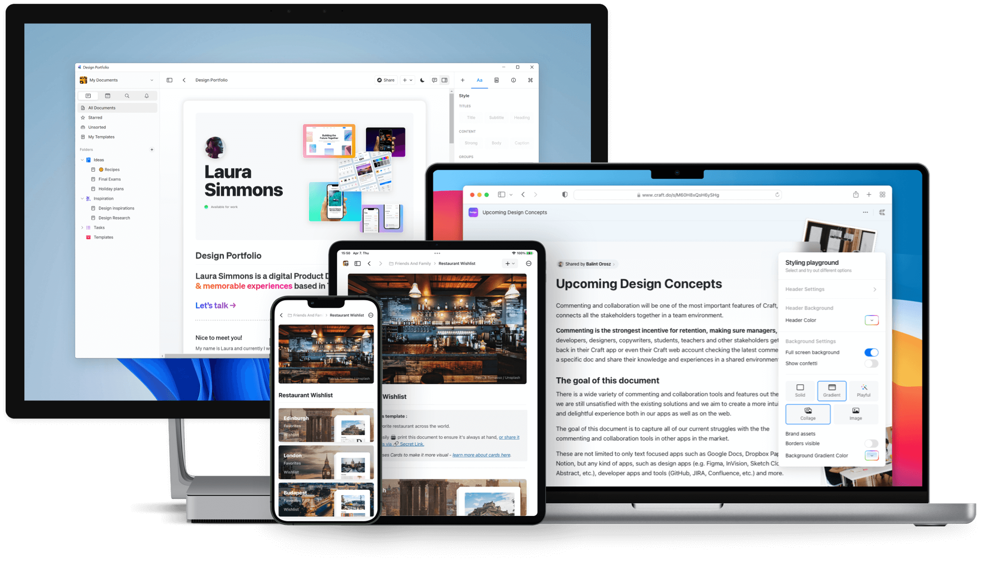

Notebooks ★
===========

[Homepage](https://www.notebooksapp.com)

 

# Features
- pretty functional
- native app
- UX is a bit lacking here and there
- notes are saved as HTML
- can store documents (pdf, word docs, etc.)
- can edit html
- lack of code highlighting
- markdown is a bit simplified (code fence doesn’t work)
- no grammar check
